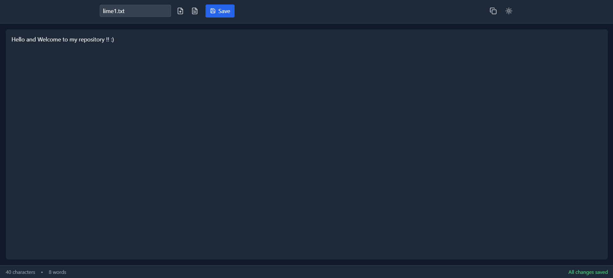

# LimeEditor



A modern, feature-rich text editor built with React and TypeScript that combines simplicity with powerful features.

## ✨ Features

- 🌓 Dark/Light mode switching
- 💾 Auto-save functionality
- 📝 Real-time word and character count
- 📤 Export to PDF
- 📋 Quick copy/paste operations
- 🔄 File import/export capabilities
- 🌐 Built-in text translation
- ⌨️ Keyboard shortcuts support

## 🚀 Quick Start

```bash
# Clone the repository
git clone https://github.com/1enMap/LimeEditor.git

# Navigate to project directory
cd LimeEditor

# Install dependencies
npm install

# Start development server
npm run dev
```

## 🛠️ Built With

- React 18
- TypeScript
- Tailwind CSS
- Vite
- jsPDF
- Lucide Icons

## ⚡ Keyboard Shortcuts

- `Ctrl/Cmd + S` - Save file
- `Ctrl/Cmd + C` - Copy selected text

## 🎯 Features in Detail

### Auto-Save
Your work is automatically saved to local storage as you type, ensuring you never lose your progress.

### PDF Export
Export your documents to PDF format with a single click, maintaining formatting and layout.

### Theme Switching
Switch between light and dark themes for comfortable editing in any lighting condition.

## 🤝 Contributing

1. Fork the repository
2. Create your feature branch (`git checkout -b feature/amazing-feature`)
3. Commit your changes (`git commit -m 'Add some amazing feature'`)
4. Push to the branch (`git push origin feature/amazing-feature`)
5. Open a Pull Request

## 📝 License

This project is licensed under the MIT License - see the [LICENSE](LICENSE) file for details.

## 👤 Author

**Rupam Laha**
- GitHub: [@RUPAMLAHA-code](https://github.com/RUPAMLAHA-code)

## 🌟 Acknowledgments

- Icons by [Lucide](https://lucide.dev)
- UI components styled with [Tailwind CSS](https://tailwindcss.com)
